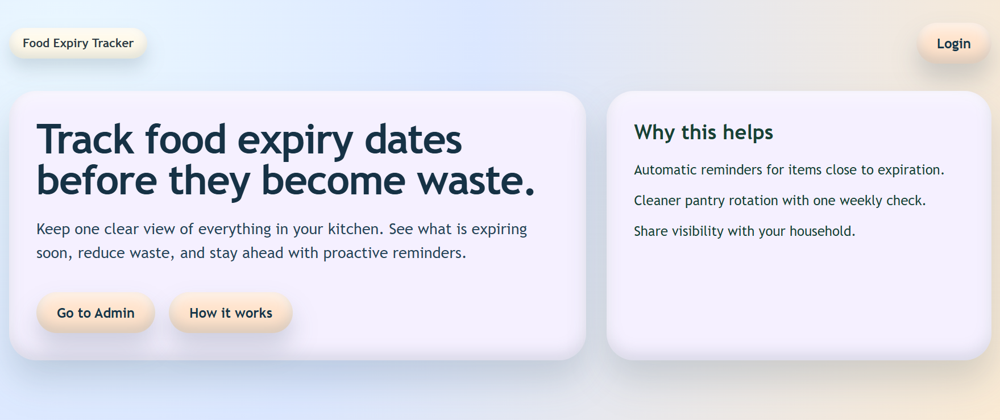
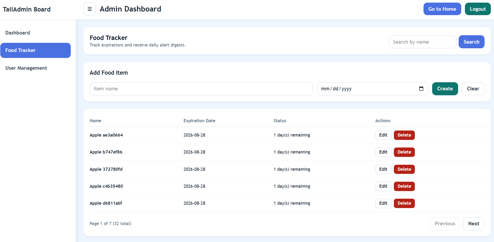

# Food Expiry Tracker

Food Expiry Tracker is a full-stack app for tracking food expiration dates, sending daily expiry alerts, and managing users with role-based access.




## Tech Stack

- Frontend: React, Vite, TypeScript, Tailwind CSS
- Backend: FastAPI, SQLAlchemy async, Alembic, APScheduler
- Database: PostgreSQL
- Local orchestration: Docker Compose

## Features

- JWT authentication with seeded admin and user accounts
- Admin area with dashboard and food tracker
- Food item CRUD with duplicate prevention
- Search and pagination for food items
- Daily expiry alert job with optional Resend integration
- User management for admin role only

## Quick Start

1. Start services:

```bash
docker compose up --build
```

2. Open app:

- Frontend: http://localhost:5173
- Backend API: http://localhost:8000
- API docs: http://localhost:8000/docs

## Default Accounts

- admin / password (role: admin)
- user / password (role: user)

## Environment Variables

Backend reads environment from `backend/.env` (optional) and runtime environment.

Common variables:

- `DATABASE_URL` (default in compose: `postgresql+asyncpg://postgres:postgres@db:5432/food_tracker`)
- `JWT_SECRET_KEY`
- `JWT_ALGORITHM`
- `JWT_ACCESS_TOKEN_EXPIRE_MINUTES`
- `RESEND_API_KEY`
- `RESEND_FROM_EMAIL`
- `RESEND_TO_EMAILS` (comma-separated)
- `EXPIRY_ALERT_DAYS` (default: `7`)

## Development Commands

### Frontend

```bash
cd frontend
npm test
npm run build
```

### Backend

Run in container (recommended):

```bash
docker compose exec backend uv run pytest
```

Run migrations manually in container:

```bash
docker compose exec backend uv run alembic upgrade head
```

## Notes

- Backend runs migrations automatically on startup in Docker Compose.
- Frontend hot reload is enabled through a bind mount in Compose.
